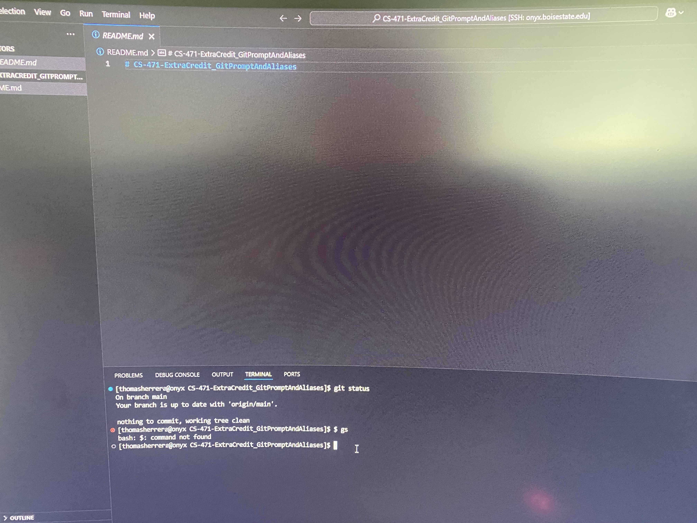
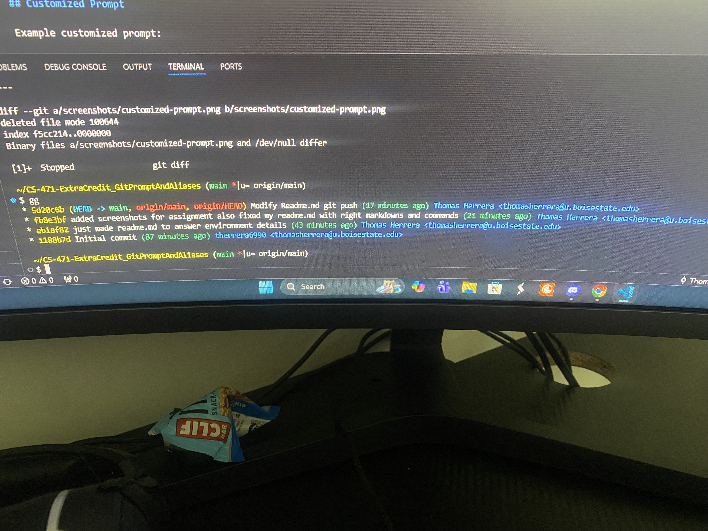
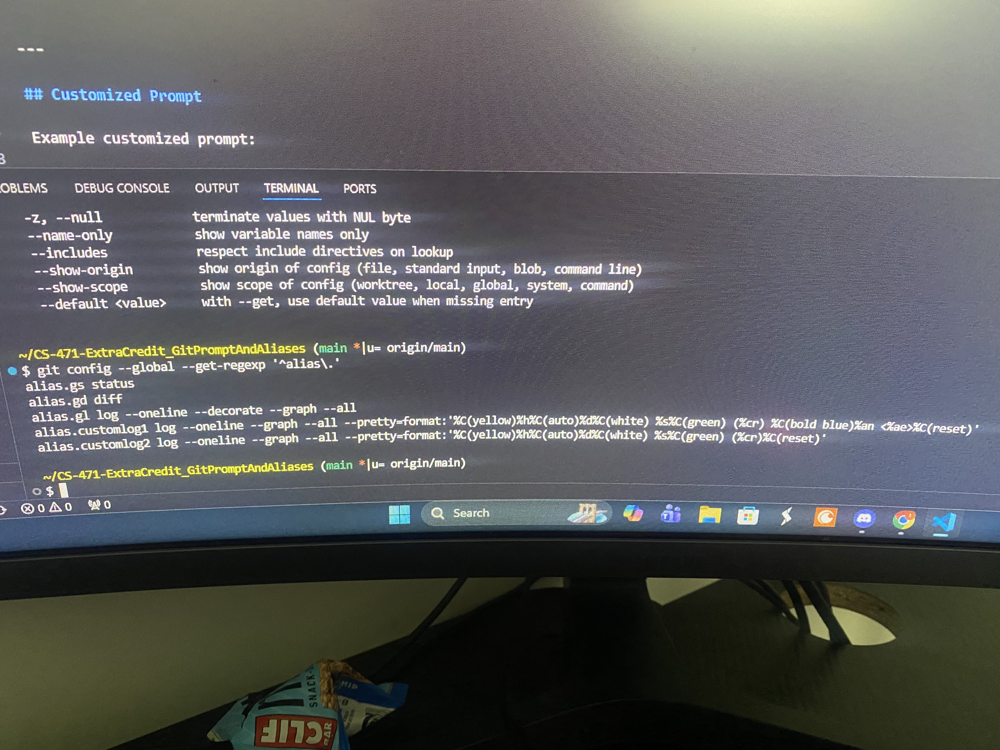

# Git Prompt and Aliases

## Author

Thomas Herrera

## Overview

This project customizes my **Bash terminal prompt** to display useful Git information and adds several **Git aliases** for commonly used commands.

The customized prompt displays:

- Current working directory
- Current Git branch
- Modified file status
- Untracked file status
- Remote tracking branch
- Ahead or behind status from the remote branch

The aliases used in this project include:

- `gs` – Git status
- `gd` – Git diff
- `gg` – Git history

---

## Environment

- **Operating System:** Linux on Onyx
- **Terminal:** Bash inside Visual Studio Code
- **Shell:** `/bin/bash`

---

## Original Terminal

Before making any modifications, my terminal used the default Onyx Bash prompt.

```text
[thomasherrera@onyx CS-471-ExtraCredit_GitPromptAndAliases]$
```

### Screenshot



---

## Bash Prompt Customization

The Bash prompt was customized by modifying:

```bash
~/.bashrc
```

The following Git prompt settings were added:

```bash
# ========================================
# CS471 Git aliases
# ========================================

alias gs='git status'
alias gd='git diff'
alias gds='git diff --staged'
alias gg='git customLog1'
alias ggb='git log --oneline --decorate --graph --all'

# ==============================================
# Enhance the Git Prompt with Git information
# ==============================================

GIT_PS1_SHOWDIRTYSTATE=true
GIT_PS1_SHOWUNTRACKEDFILES=true
GIT_PS1_SHOWSTASHSTATE=true
GIT_PS1_SHOWUPSTREAM="verbose name"
GIT_PS1_SHOWCOLORHINTS=true
```

After saving the file, the Bash configuration was reloaded using:

```bash
source ~/.bashrc
```

---

## Customized Prompt

The customized prompt displays Git information directly in the terminal.

Example:

```text
~/CS-471-ExtraCredit_GitPromptAndAliases (main * origin/main)
$
```

where:

- `main` = current Git branch
- `*` = unstaged changes
- `+` = staged changes
- `%` = untracked files
- `$` = stashed changes
- `>` = local branch is ahead of remote
- `<` = local branch is behind remote
- `=` = local branch matches the remote branch

---

## Git Aliases

### 1. `gs` - Git Status

The `gs` alias runs:

```bash
git status
```

Usage:

```bash
gs
```

### Screenshot

.png)

---

### 2. `gd` - Git Diff

The `gd` alias runs:

```bash
git diff
```

Usage:

```bash
gd
```

### Screenshot

.png)

---

### 3. `gg` - Git History

The `gg` alias runs my custom Git log command.

Usage:

```bash
gg
```

The custom Git log alias was created using:

```bash
git config --global alias.customLog1 "log --oneline --graph --all --pretty=format:'%C(yellow)%h%C(auto)%d%C(white) %s%C(green) (%cr) %C(bold blue)%an <%ae>%C(reset)'"
```

### Screenshot



---

## Alias Verification

I verified the Git aliases using:

```bash
git config --global --get-regexp '^alias\.'
```

Example output:

```text
alias.gs status
alias.gd diff
alias.gl log --oneline --decorate --graph --all
alias.customLog1 log --oneline --graph --all
```

### Screenshot



---

## Alias Summary

| Alias | Command | Purpose |
|:------|:--------|:--------|
| `gs` | `git status` | Shows repository status |
| `gd` | `git diff` | Shows file changes |
| `gg` | `git customLog1` | Shows Git history |

---

## Resources Used

- Git documentation
- Bash documentation
- CS471 assignment README
- Examples provided by the professor
- ChatGPT for help understanding the assignment and troubleshooting `.bashrc` syntax errors

---

## Notes

- The Bash prompt configuration is stored in `~/.bashrc`.
- The customized prompt displays Git information automatically.
- The aliases reduce the amount of typing needed for common Git commands.
- `gs` shows the repository status.
- `gd` shows file changes.
- `gg` displays Git history in a compact graphical format.